# ESIEE_SEI_5201A

## Table des matières

- [Préambule](#préambule)
  - [Evaluation](#evaluation)
  - [Environnement logiciel](#environnement-logiciel)
  - [Environnement matériel](#environnement-matériel)
  - [Documentation](#documentation)
  - [Sources](#sources)
- [labo01 : Prise en main de l'outil Impulse](#labo01--prise-en-main-de-loutil-impulse)
- [labo02 : Prise en main du System-on-Chip (SoC)](#labo02--prise-en-main-du-system-on-chip-soc)
- [labo03 : Esclave modbus](#labo03--esclave-modbus)
- [labo04 : Ajout d'un CRC matériel](#labo04--ajout-dun-crc-matériel)
- [labo05 : Lock-Step](#labo05--lock-step)
- [labo06 : Lock-Step et superviseur](#labo06--lock-step-et-superviseur)
- [labo07 : TMR](#labo07--tmr)
- [Annexe : Contournement d’une erreur dans le compilateur C](#annexe--contournement-dune-erreur-dans-le-compilateur-c)

## Préambule

Dans ces séances de TP, nous allons utiliser un System-on-Chip (SoC) académique à base d'un clone du microcontrôleur 8 bits PicoBlaze3 et de quelques périphériques GPIO, UART, SPI, Timer, ...

Les TP sont découpés en 4 parties :

1. Prendre en main l'environnement logiciel et matériel (labo01 et labo02)
2. Implémenter un nouveau périphérique et son intégration dans le SoC existant (labo03 et labo04)
3. Mise en place de la technique du Lock-Step (labo05 et labo06)
4. Mise en place de la technique de la triplication (TMR) (labo07)

> [!IMPORTANT]
> Les premiers labos sont dirigistes, la difficulté et l'autonomie requise sont croissantes.

### Evaluation

#### Livraison

Archive contenant le rapport et vos codes sources.

#### Rapport

Un rapport d’une dizaine de pages doit être fourni pour évaluer les acquis de cette unité.

> [!IMPORTANT]
> Vous pouvez utiliser l'IA pour générer votre rapport, cependant il faudra le préciser dans l'énoncé.

Ce rapport possède les sections suivantes :

- Introduction
  - Dans cette partie, vous expliquerez les enjeux d’un circuit numérique pour une application spatiale.
- Outils et environnement (labo 1 à 2)
  - Dans cette partie, vous discuterez des outils utilisés au cours de ces TPs et de votre retour personnel (prise en main, complexité, problèmes rencontrés...).
- Application de référence (labo 3 et labo 4)
  - Dans cette partie, vous détaillerez l’architecture de référence
    - Vous pouvez fournir du code commenté
    - Il est intéressant de fournir des résultats pertinents comme :
      - Le nombre de LUT / DFF de votre implémentation
      - La fréquence maximale de votre implémentation
      - Vous devrez répondre aux questions
- Lock-Step (labo 5)
  - Dans cette partie, vous détaillerez l’approche Lock-Step
  - Vous expliquerez les modifications architecturales
  - Vous fournirez également des résultats pertinents du labo 5
  - Vous devrez répondre aux questions
- Superviseur (labo 6)
  - Dans cette partie, vous détaillerez l’intérêt du SoC Superviseur
  - Vous détaillerez l’architecture du SoC superviseur
  - Vous expliquerez également les domaines des resets
  - Vous fournirez également des résultats pertinents du labo 6
  - Vous devez également répondre à ces 4 questions :
    - Que ce passe t’il si un SEE intervient dans l’un des processeurs applicatifs ?
    - Que se passe-t-il si un SEE intervient dans l’un des GPIOs du SoC applicatif ?
    - Que se passe-t-il si un SEE intervient dans le processeur du SoC superviseur ?
    - Que se passe-t-il si un SEE intervient dans l’un des GPIOs du SoC superviseur ?
- TMR (labo 7)
  - Dans cette partie, vous détaillerez le principe d’une approche de type TMR
  - Vous fournirez également des résultats pertinents du labo 7
  - Vous devrez répondre aux questions
- Conclusion
  - Dans cette dernière partie, vous confronterez une approche non tolérante aux radiations avec une approche résistante par architecture. Vous pourrez évaluer la facilité de mise en œuvre, le coût en surface, les performances en termes de fréquence d’horloge.

### Environnement logiciel

Pour réaliser ce TP, l'environnement logiciel est encapsulé dans une machine virtuelle basée sur une distribution CentOS 8 dont les identifiants sont les suivants :

> [!IMPORTANT]
> **Login**    : user
> **Password** : user

### Environnement matériel

Ce TP utilise la carte de développement DK625 intégrant un FPGA NX1H35S.
Il s'agit d'un FPGA rad-hard de 35K LUT de la société NanoXplore.

Dans ce TP, nous allons utiliser 2 outils :

- L'outil **impulse** génère un bitstream à partir des codes VHDL / Verilog.
- L'outil **nxbase** télécharge le bitstream dans le FPGA.

 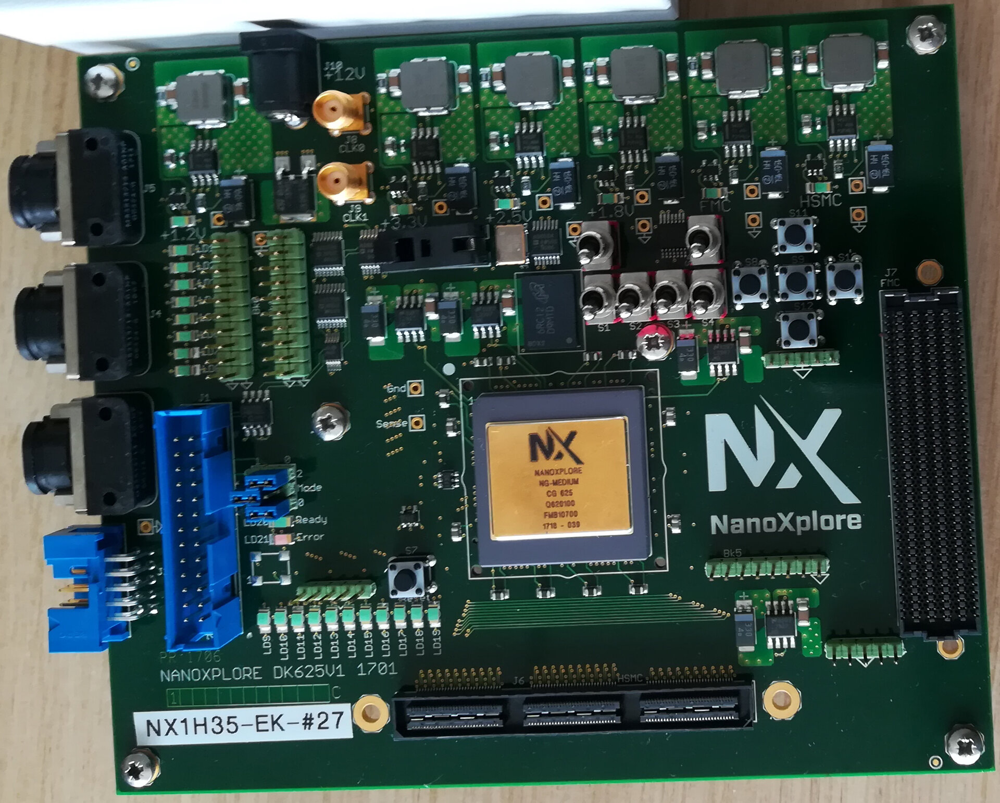

### Documentation

Les documentations sont disponibles dans les liens suivants :

| Documentation |       Lien |
|---------------|------|
| CPU           | [ug129](https://docs.amd.com/v/u/en-US/ug129) |
| Devkit        | [NanoXplore_NX1H35S_DevKitV3_User_Guide](https://files.nanoxplore.com/f/79d605999def475da0ec/) |
|               | [NanoXplore_NX1H35S_DevKitV3_Schematics](https://files.nanoxplore.com/f/c5dcf72c018e44939a2f) |
| NG-MEDIUM     | [NanoXplore NX1H35AS Datasheet](https://files.nanoxplore.com/f/5ad5e8a333654fb2ac76) |

### Sources

Les sources du TP sont disponibles sur le dépôt suivant :
> https://github.com/deuskane/ESIEE_SEI_5201A 

Récupérer les sources en clonant le dépôt :

```bash
git clone https://github.com/deuskane/ESIEE_SEI_5201A.git
```

## labo01 : Prise en main de l'outil Impulse

Dans cette première partie, nous allons prendre en main l’environnement logiciel **impulse**.

1. Éditez le fichier *labo01/hdl/labo01.vhd* pour réaliser la fonctionnalité illustrée dans la Figure suivante.
   

2. Dans le répertoire *labo01/project*, lancez la commande **impulse**.
   Cette commande ouvre l’interface graphique présentée dans la figure suivante.
   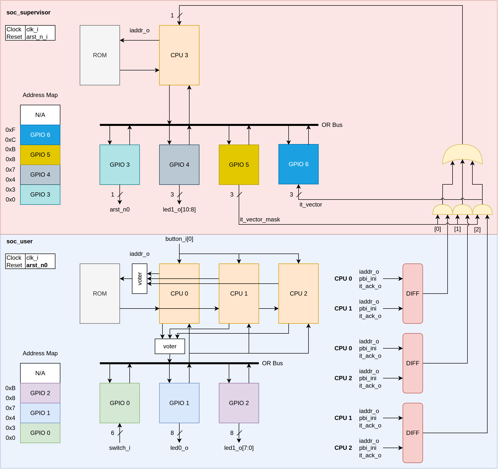

3. Créer un nouveau projet

   Create New Project (ou File/Project)
   - Onglet «1. Set Project Information»

     | Champ        | Valeur         | Description |
     |--------------|----------------|---------------|
     | Project Name | labo01         | Nom du projet |
     | Path         | labo01/project | Définition du dossier de travail. |

     

   - Onglet « 2. Add Sources »
      - Ajouter le fichier *labo01/hdl/labo01.vhd*
      - Définir le Top cell name comme étant **labo01**

       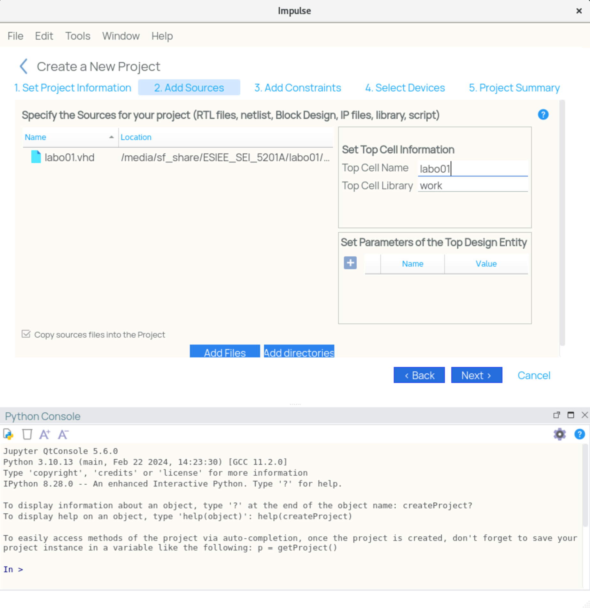

   - Onglet « 4. Select Devices »

      | Champ        | Valeur       | Description   |
      |--------------|--------------|---------------|
      | Device       | NG-MEDIUM    | |
      | Package      | LGA-625      | |

      

   - Onglet « 5. Project Summary»

      Après avoir vérifié les informations, cliquez sur « Finish »

   Après avoir créé le projet, la fenêtre de travail apparaît.

   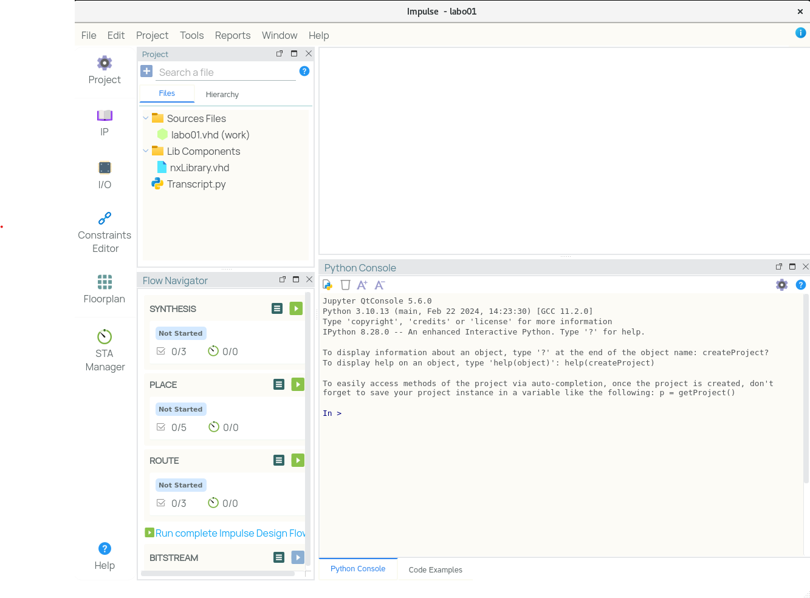

4. Sauvegardez votre projet :

   ```text
   File>Save Project
   ```

5. Affectation des IOs

   Au début d’un projet, les IOs et les bancs ne sont pas configurés : le placement des IOs sera automatique ce qui peut être **dangereux** pour une exécution sur carte.

   Pour cet exemple, vous devez avoir la configuration suivante :

   | HDL Name      | FPGA Name       | PCB Name |
	 |---------------|-----------------|----------|
   | led_n_o[0]    | IOB0_D01P       | LD1	    |
   | led_n_o[1]    | IOB0_D03N       | LD2      |
   | led_n_o[2]    | IOB0_D03P       | LD3	    |
   | led_n_o[3]    | IOB1_D05N       | LD4	    |
   | led_n_o[4]    | IOB1_D05P       | LD5	    |
   | led_n_o[5]    | IOB1_D06N       | LD6	    |
   | led_n_o[6]    | IOB1_D06P       | LD7	    |
   | led_n_o[7]    | IOB1_D02N       | LD8	    |
   | switch_i[0]   | IOB10_D09P      | S1	      |
   | switch_i[1]   | IOB10_D03P      | S2       |
   | switch_i[2]   | IOB10_D03N      | S3	      |
   | switch_i[3]   | IOB10_D04P      | S4	      |
   | switch_i[4]   | IOB10_D09N      | S5	      |
   | switch_i[5]   | IOB10_D04N      | S6       |

   | Bank Name     | Voltage |
	 |---------------|---------|
   | IOB0          | 3.3V    |
   | IOB1          | 3.3V	   |
   | IOB10         | 1.8V    |

   Exportez la configuration dans le fichier labo01/hdl/pads.py

6. Sauvegardez votre projet
7. Synthèse : Cliquer sur *Synthesis*
8. Placement : Cliquer sur *Place*
9. Routage : Cliquer sur *Route*
10. Générer un Bitstream : Cliquer sur *Bitstream*
11. Dans le dossier labo01/project il y a les fichiers suivants :
    - *pads.py* : fichier d’affectation des IOs et de configuration des bancs
    - *labo01.nxb* : fichier de bitstream
    - *Fichiers \*.nym* : Fichier interne à la suite Impulse
    - *transcript.py* : Fichier pour relancer le projet en ligne de commande
    - *logs* : contient les différents logs de l’outils :
      - *instances.rpt* : ce fichier fournit les statistiques d'utilisation des ressources internes du FPGA.

        ```text
        Ce labo utilise 6 LUTs, ces dernières réalisent les 6 inverseurs du design
        ```

        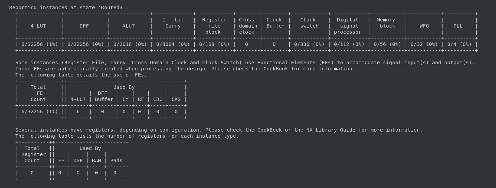

      - *ios.rpt* : ce fichier fournit un résumé des E/S.

12. Téléchargement du bitstream sur la carte :

    Dans le répertoire labo01/nxmap, exécutez-le avec la commande suivante :

    ```bash
    nxbase2 labo01.nxb
    ```

> [!WARNING]
> Le périphérique USB « **584E:424E** » doit être accessible par la VM, sinon vous risquez d'avoir le message suivant :
>
> No board found, please plug a board

> [!NOTE]
> Après la première exécution, Windows va remapper le périphérique inconnu en « **Nanoxplore Angie USB-JTAG** ». Ce périphérique doit également être accessible par la VM, sinon vous risquez d'avoir le message suivant : 
>
> Cannot find the new board

13. Expérimenter sur carte

    La connexion entre **nxbase2** et le devkit est établie lorsque l'exécution de la commande affiche le message suivant :

    ```text
    Init board up to a loadable state
    ```

## labo02 : Prise en main du System-on-Chip (SoC)

Dans cette partie, nous allons réaliser la même fonctionnalité que dans le labo01 (c'est à dire lire les switchs et les envoyés sur les leds), mais avec un System-on-Chip (SoC) à base d'un clone du PicoBlaze3.

Les IPs sont présentes dans le dépôt git suivant :
> [https://github.com/deuskane](https://github.com/deuskane)

Dans la suite de ce TP, nous utiliserons l’outil fusesoc et son encapsulation dans des Makefile.
> [https://github.com/olofk/fusesoc](https://github.com/olofk/fusesoc)

Cet outil gère les IPs et aide à créer, construire et simuler des SoC.

1. Placez-vous dans le dossier **labo02**

   ```bash
   cd labo02
   ```

2. Exécutez le script **init.sh**.

    ```bash
    ./init.sh
    ```

    Ce script va cloner le dépôt **asylum-soc-picosoc** qui contient les sources du SoC.

    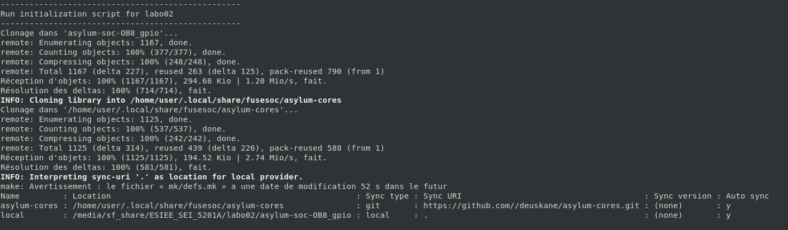

    Ensuite, le script va configurer fusesoc. Le script va afficher la liste des libraries (ici asylum-cores et local) ainsi que la liste des modules disponibles.

    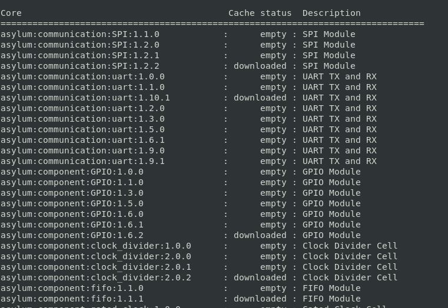

> [!WARNING]
> Ce script ne doit être exécuté qu'une fois.

3. Placez-vous dans le dossier nouvellement créé **asylum-soc-picosoc**. Celui-ci contient les fichiers et dossiers suivants :

    | Fichier / Dossier | Description                                                               |
    |-------------------|---------------------------------------------------------------------------|
    | README.md         | Fichier d’aide                                                            |
    | hdl               | Dossier contenant le code source du SoC                                   |
    | sim               | Dossier contenant le testbench du SoC                                     |
    | esw               | Dossier contenant les codes applicatifs à exécuter par le processeur      |
    | boards            | Dossier contenant les fichiers spécifiques pour une intégration sur carte |
    | tools             | Dossier contenant des scripts                                             |
    | PicoSoC.core      | Fichier de description de l’IP pour l’outil fusesoc                       |
    | fusesoc.conf      | Fichier de configuration de l’outil fusesoc                               |
    | Makefile          | Fichier d’execution de commande                                           |
    | mk                | Dossier contenant les fichiers pour le Makefile                           |

4. Toutes les commandes sont encapsulées avec l’outil **make**. Une aide est disponible en exécutant la commande suivante :

    ```bash
    make help
    ```

    L'aide est divisée en 3 parties :
    1. Les variables du makefile qui peuvent être surchargé
    2. Les règles du Makefile disponible
    3. Les informations contenues dans le fichier **PicoSoC.core**

    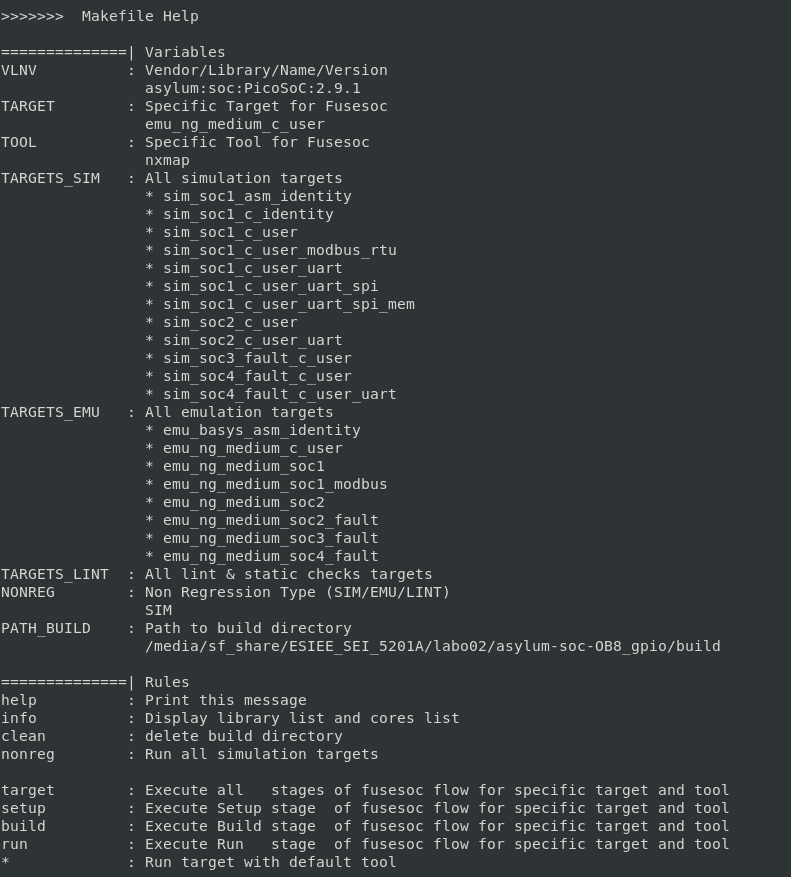
    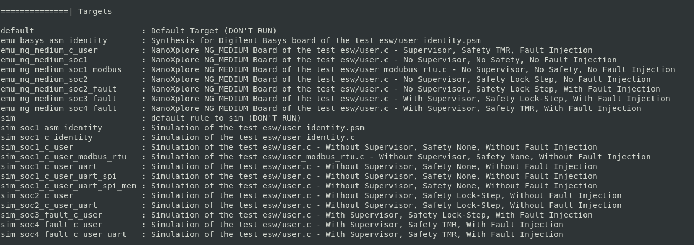

5. Le fichier **asylum-soc-picosoc/hdl/PicoSoC_top.vhd** contient le top level du SoC présenté dans la Figure 1.

   Ce SoC contient 2 contrôleurs GPIO, le premier connecté aux switchs, le second connecté aux LEDs.

   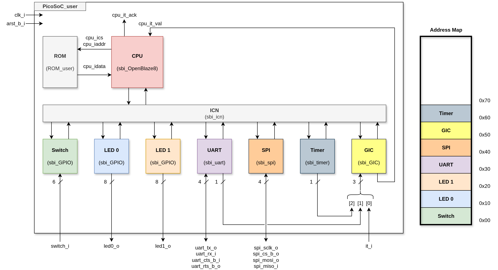

   Ouvrir le code source et lister les modules. Les modules doivent être listés dans l'étape 2... sauf 1, lequel et pourquoi ?

6. Le dossier **asylum-soc-picosoc/esw** contient l’application *identity* qui va lire les switchs et les écrire sur les leds en continu. L’application est écrite en C (identity.c) et en assembleur PicoBlaze (identity.psm).

   Lancer la simulation avec l’application écrite en C en utilisant la commande suivante :

   ```bash
   make sim_soc1_c_identity
   ```

   Que fait l’exécution de cette commande ?

7. Les fichiers générés par les générateurs de fusesoc sont localisés dans le dossier de cache de l'outil.

   Attention, le nom du fichier dépend du VLNC du module (Vendor Library Name Version), du nom du générateur (ici *gen_user_c_identity*) et d'un hash. Le chemin suivant est à titre indicatif :

   ```bash
   cd ~/.cache/fusesoc/generator_cache/asylum_soc_PicoSoC-gen_user_c_identity_2.9.1-f5fb100af797341fb2eb657ead4a0e2a4609165d461f96b8b2ea0908b4860977
   ```

   - Que contient ce dossier ?
   - Comparer le fichier **user_identity.psm** généré avec le fichier **asylum-soc-picosoc/esw/identity.psm**
      - Localiser la boucle d'écriture dans l'étape 7
      - Combien d'instructions contient le fichier **user_identity.psm** généré par le compilateur ?
      - Pourquoi le fichier  **asylum-soc-picosoc/esw/identity.psm** contient moins d'instructions ?
   - Le fichier **asylum-soc-picosoc/esw/identity.log** contient en plus du code assembleur généré par le compilateur, l'adresse de chaque instruction et son code en hexadécimal (une instruction picoblaze est sur 18 bits).
      - À quelle adresse commence la fonction **main** ?
      - Quels sont les instructions exécuté pour arriver à la fonction **main** ?
      - A quoi sert l'instruction suivante :

        ```assembler
        __sdcc_loop:
        JUMP __sdcc_loop
        ```

        Expliquer pourquoi cette instruction est situé après l'appel à la fonction **main**.
   - Que contient le fichier **user_identity.vhd** ?
      - Quel est le nom du module ?
      - Décrire le contenu du module

> [!WARNING]
> Les fichiers psm contiennent des directives de compilation (EQU, ORG), des directives de simulation (DSIN, DSOUT) et des labels. Ce ne sont pas des instructions

8. La simulation a généré un chronogramme.
    Ouvrir ce fichier à l’aide de la commande suivante :

    ```bash
    gtkwave build/asylum_soc_PicoSoC_2.9.1/sim_soc1_c_identity-ghdl/dut.fst
    ```

    Observer les signaux internes au SoC (instance **tb_PicoSoC/dut/ins_soc_user**). Les signaux du processeur 0 sont préfixés **cpu0**.

    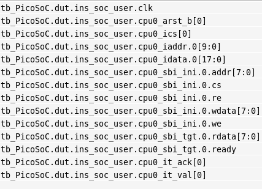

    Le processeur ainsi que tous les périphériques de ce SoC utilisent l'interface SBI (Simple Bus Interface) telle que définie dans le framework de vérification [**UVVM**](https://uvvm.github.io/vip_sbi.html#sbi-protocol).
    1. Observer la boucle d'instruction identifiée dans l'étape 7, en déduire la latence entre 2 lectures de switchs.
    2. En déduire le temps d’exécution d’une instruction.

9. La commande suivante va préparer la compilation du  **PicoSoC_top** pour le FPGA **NG_MEDIUM** avec l'application *identity* écrite en C

    ```bash
    TARGET=emu_ng_medium_soc1 make setup
    ```

    La commande suivante va compiler le projet avec l'outil **impulse**

    ```bash
    TARGET=emu_ng_medium_soc1 make build
    ```

    La commande suivante va initialiser le devkit et télécharger le bitstream généré dans le FPGA

    ```bash
    TARGET=emu_ng_medium_soc1 make run
    ```

    L’exécution de la commande `make run` doit fournir la sortie suivante :

    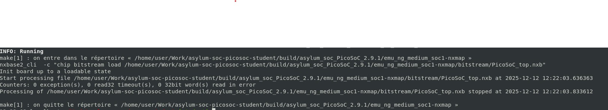

> [!WARNING]
> Lancer la phase **build** avant la phase **setup** va vous générer une erreur
>
> 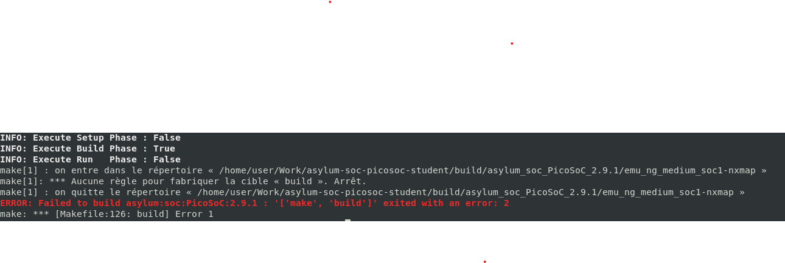

> [!TIP]
> Il arrive parfois que la commande échoue et ne parvienne pas à se connecter à la carte via l'USB de la VM ; n'hésitez pas à relancer la commande `make run`

10. Modifier le code source exécuté par le processeur : **asylum-soc-picosoc/esw/identity.c** pour inverser l'état des switchs avant de les envoyer sur les LEDs.

11. Simuler le design.

    - Quel résultat obtenez-vous ?
    - Modifier le code de test en conséquence (**asylum-soc-picosoc/sim/tb_PicoSoC.vhd**)

12. Valider sur carte

## labo03 : Esclave modbus

A partir du SoC précédent, nous allons prendre une application plus représentative : **un esclave modbus**.

Un esclave Modbus RTU est un périphérique qui répond aux requêtes d'un maître sur une liaison série. Il reçoit des trames Modbus RTU contenant l'adresse d'esclave, le code fonction, les données et un CRC 16 bits, exécute les opérations demandées (lecture/écriture de registres ou de bobines) et renvoie une réponse ou un code d'erreur.

Modbus RTU délimite les trames par des périodes de silence et est couramment utilisé pour des communications fiables entre automates, capteurs et actionneurs.

Dans la suite du TP, nous allons implémenter un esclave Modbus RTU qui a les caractéristiques suivantes :

| Type                          | Valeur                        |
|-------------------------------|-------------------------------|
| Adresse de l'esclave          | 0x5A                          |
| Baud Rate de la liaison série | 9600                          |
| Fonctions Modbus supportées   | Read Holding Registers (0x03) |
|                               | Write Single Register (0x06)  |

1. Placez-vous dans le dossier **labo03**

   ```bash
   cd labo03
   ```

2. Exécutez le script **init.sh**.

   ```bash
   ./init.sh
   ```

    Ce script va copier le dossier **labo02/asylum-soc-picosoc** dans le dossier **labo03**.

> [!WARNING]
> Ce script ne doit être exécuté qu'une fois.

3. L'esclave Modbus va utiliser le logiciel présent dans le fichier **asylum-soc-picosoc/esw/user_modbus_rtu.c**. Ce dernier va exécuter en boucle la fonction **modbus_slave** et va attendre des caractères provenant de l'UART.

   L'environnement de simulation est fourni dans le fichier **asylum-soc-picosoc/sim/tb_PicoSoC_modbus.vhd**

   Lancez la simulation :

   ```bash
   make sim_soc1_c_user_modbus_rtu
   ```

   Déterminer combien de cycles sont nécessaire pour faire le calcul du CRC:
   - Localiser la fonction qui ajoute un mots de 8b au crc
   - Déterminer l'adresse de début et de fin de cette fonction
   - Dans la waveform générée, combien de cycles sont nécessaires pour exécuter cette fonction ?
     - Est-ce que le temps d'exécution de cette fonction est constant ?
     - En regardant le code généré, quel est le nombre d'instructionœ maximale par bit de donnée, en déduire le nombre de cycle nécessaire. Comparer le résultat obtenu avec celui de l'analyse de la waveform.

4. Pour réaliser la validation sur cible, il faut un maître Modbus qui sera présent sur votre station de travail et se connectera à l'application dans le FPGA au travers d'une puce [FTDI232RL](https://ftdichip.com/wp-content/uploads/2020/08/DS_FT232R.pdf) incluse dans la puce [SH-U09C2 USB to TTL Adapter](https://www.deshide.com/product-details_SH-U09C2.html).

   La connexion entre l'adaptateur se fait comme indiqué sur la photo suivante :

   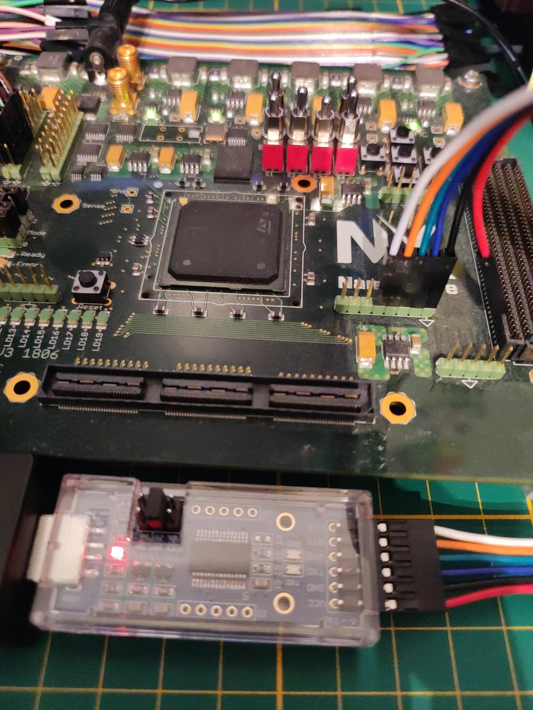

   Ainsi les broches du banc 5 sont connecté comme tel :

   | HDL Name        | FPGA Name       | PCB Name | Emplacement   | Couleur du câble |
	 |-----------------|-----------------|----------|---------------|------------------|
   | debug_uart_tx_o | IOB5_D05P       | P505     | 2ème à gauche | N/A              |
   | N/A             | IOB5_D05N       | N505     | 3ème à gauche | N/A              |
   | uart_rts_b_o    | IOB5_D01P       | P501     | 4ème à gauche | Blanc            |
   | uart_cts_b_i    | IOB5_D01N       | N501     | 5ème à gauche | Orange           |
   | uart_tx_o       | IOB5_D03P       | P503     | 6ème à gauche | Vert             |
   | uart_rx_i       | IOB5_D03N       | N503     | 7ème à gauche | Bleu             |
   | N/A             |                 | GND      | 8ème à gauche | Noir             |

    Note : les connexions du FPGA sont présentes dans le fichier **asylum-soc-picosoc/boards/NanoXplore-DK625V0/pads.py**

    Une fois l'adaptateur connecté, lancez la compilation avec l'esclave Modbus :

    ```bash
    TARGET=emu_ng_medium_soc1_modbus make target
    ```

> [!TIP]
> La règle de makefile **target** est équivalente à **setup**, **build** et **run**

5. Une fois l'application chargé dans le FPGA, lancer le script **asylum-soc-picosoc/tools/modbus_server.py** qui va effectuer les actions suivantes en continue :

   - Lire les switchs
   - Ecrire la valeur des switchs dans le contrôleur LED0
   - Ecrire la valeur d'un compteur dans le contrôleur LED1
   - Incrémenter le compteur

## labo04 : Ajout d'un CRC matériel

Les labo 1 et 2 vous ont familiarisés avec l'environnement logiciel et matériel.

Le labo 3 a abordée l'application que nous allons utiliser pour les prochaines parties.

L'esclave Modbus prend en charge les fonctions 3 (lecture de registres) et 6 (écriture de registre unique). Une documentation détaillée est accessible via ce lien : [doc/guide_modbus.pdf](doc/guide_modbus.pdf)


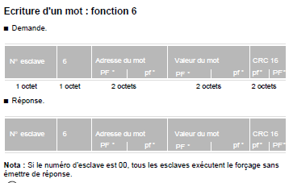

Afin d'assurer l'intégrité des données échangées entre le maître et l'esclave, le protocole impose un calcul de CRC (Contrôle de Redondance Cyclique) suivant l'algorithme ci-dessous :

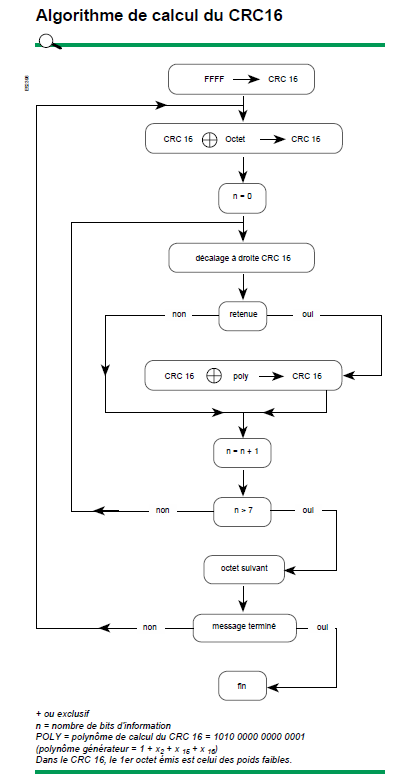

Actuellement, ce calcul est réalisé par logiciel, une méthode dont nous avons évalué la latence lors du TP précédent.

L'objectif de ce laboratoire est de concevoir un périphérique matériel dédié au calcul du CRC pour décharger le processeur de cette tâche.

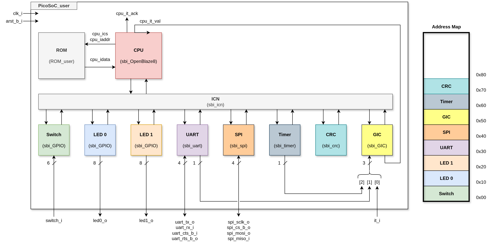

1. Placez-vous dans le dossier **labo04**

   ```bash
   cd labo04
   ```

2. Exécutez le script **init.sh**.

   ```bash
   ./init.sh
   ```

   Ce script va copier le dossier **labo03/asylum-soc-picosoc** dans le dossier **labo04**.

> [!CAUTION]
> Ce script ne doit être exécuté qu'une fois.
> [!NOTE]
> Durant vos expériences professionnelles, vous allez devoir utiliser l'infrastructure, les styles de codage et l'environnement de travail de votre société. Ce labo vous permet de vous initier à cela.

3. L'interface de registres est générée avec un outil **regtool** qui est situé dans le dépôt suivant : [https://github.com/deuskane/asylum-utils-generators](https://github.com/deuskane/asylum-utils-generators).

   Créez le fichier **asylum-soc-picosoc/hdl/crc.hjson**.
   Pour la syntaxe, vous pouvez vous inspirer de celui du timer disponible à ce lien : [https://github.com/deuskane/asylum-component-timer/blob/main/hdl/csr/timer.hjson](https://github.com/deuskane/asylum-component-timer/blob/main/hdl/csr/timer.hjson).

   Le module doit avoir les registres suivants :

   | Nom       | Address | swtype     | hwtype     | Commentaire                    |
   |-----------|---------|------------|------------|--------------------------------|
   | data      | 0x0     | Read/Write | Read Only  | Donnée à accumuler dans le CRC |
   | crc_byte0 | 0x2     | Read/Write | Read/Write | CRC [7:0]                      |
   | crc_byte1 | 0x3     | Read/Write | Read/Write | CRC [15:8]                     |

4. Compléter le fichier PicoSoC.core.

   1. Ajouter la génération du banc de registres
  
      ```text
      #---------------------------------------
      gen_csr:
      #---------------------------------------
        generator : regtool
        parameters:
          file         : csr/crc.hjson
          name         : crc
          copy         : hdl
          logical_name : asylum
      ```

   2. Ajouter l'appel au générateur dans la target **default** :
  
      ```text
      #---------------------------------------
      default: &default
      #---------------------------------------
        description     : Default Target (DON'T RUN)
        filesets        :
          - files_hdl
        toplevel        : PicoSoC
        default_tool    : ghdl
        generate        :
          - gen_csr
      ```

   3. Lancer la simulation pour générer les fichiers (utiliser la cible **sim_soc1_c_user_modbus_rtu**)

      Le générateur va vous générer les fichiers suivants :

      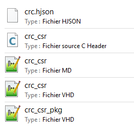

      Le fichier **crc_csr_pkg.vhd** va vous fournir les types VHDL que vous allez utiliser pour l'intégration du CSR (Configuration and Status Registers) dans votre module **sbi_crc**.
      C'est également le module CSR qui aura un port esclave SBI.

5. Creée le module **sbi_crc** dans le fichier **asylum-soc-picosoc/hdl/sbi_crc.vhd** avec l'interface suivante :

   | Nom      | Direction | Type      | Commentaire                          |
   |----------|-----------|-----------|--------------------------------------|
   | clk_i    | in        | std_logic | Horloge du module crc                |
   | arst_b_i | in        | std_logic | Reset asynchrone actif bas           |
   | sbi_ini_i| in        | sbi_ini_t | Interface SBI provenant du maître    |
   | sbi_tgt_o| out       | sbi_tgt_t | Interface SBI provenant de l'esclave |

   Ce module va instancier le module **CRC_registers** crée à l'étape d'avant.  

6. Intégrer le module **sbi_crc** dans le SoC **PicoSoC_user** (**asylum-soc-picosoc/hdl/PicoSoC_user.vhd**).

   Le module CRC devra être positionné à l'adresse de base **0x70**.

> [!NOTE]
> Aidez-vous de l'intégration du module **sbi_timer**.

7. Modifiez le firmware du SoC **PicoSoC_user**, disponible dans le fichier **asylum-soc-picosoc/esw/user_modbus_rtu.c**.

   Ce fichier C contient la macro **CRC_HW** :

   - Si elle n'est pas définit, les fonctions **crc16_next** et **crc16_init** vont utiliser la version logicielle du CRC16
   - Si elle est définit, les fonctions **crc16_next** et **crc16_init** vont utiliser le périphérique que vous avez développer.

8. Une fois le périphérique développé (étapes 3 à 5) et intégré (étapes 6 à 7), vous pouvez lancer la simulation.

   Les 2 images suivantes vous présentes les données et la valeurs du CRC pour la première requête.

   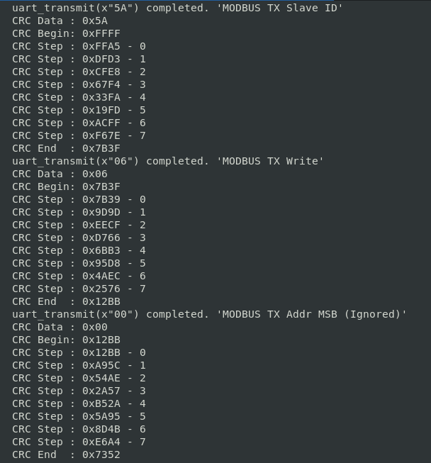

   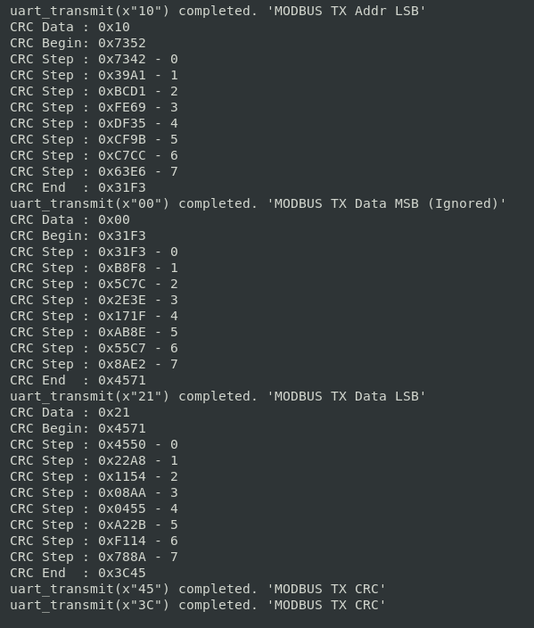

9. Dès que la simulation opérationnelle, vous pouvez lancer votre application sur la carte

   - Combien de registres avez-vous utilisés dans votre design (incluant le CSR) ?
   - Combien de ressources (LUT + DFF) avez-vous en plus ?

## labo05 : Lock-Step

Dans cette partie, nous allons réaliser une implémentation avec « Lock Step » du SOC vu dans le labo04.

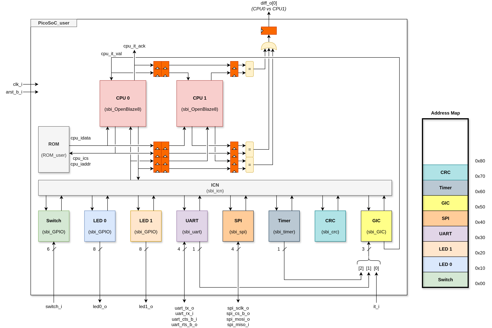

1. Placez-vous dans le dossier **labo05**

   ```bash
   cd labo05
   ```

2. Exécutez le script **init.sh**.

   ```bash
   ./init.sh
   ```

   Ce script va copier le dossier **labo04/asylum-soc-picosoc** dans le dossier **labo05**.

> [!CAUTION]
> Ce script ne doit être exécuté qu'une fois.

3. Éditez le fichier **asylum-soc-picosoc/hdl/PicoSoC_user.vhd** pour ajouter un 2ème processeur

   - Le module **PicoSoC_user** dispose du paramètre **SAFETY** qui dispose de 3 valeurs. Se paramètre va influencé les constantes **CPU1_ENABLE**, **CPU2_ENABLE** et **LOCK_STEP_DEPTH_INT** :

      | SAFETY    | CPU1_ENABLE | CPU2_ENABLE | LOCK_STEP_DEPTH_INT | Commentaire                                                                                       |
      |-----------|-------------|-------------|---------------------|---------------------------------------------------------------------------------------------------|
      | none      | false       | false       | 0                   | Un seul processeur est implémenté.                                                                |
      | lock-step | true        | false       | LOCK_STEP_DEPTH     | 2 processeurs sont implémentés, le processeur primaire (cpu 0) et le processeur redondant (cpu 1).|
      | tmr       | true        | true        | 0                   | 3 processeurs sont implémentés, les sorties de chaque processeur sont votés.                      |

> [!NOTE]
> La variante **tmr** sera vu pour le labo07.

   - Lister les sorties du processeur.

   - Créer le registre **diff_r** qui va être initialisé à 0 après un reset et qui va être mis à 1 si l’une des sorties du processeur 0 diffère de celle du processeur 1.

4. Valider en simulation que le comportement est inchangé par rapport à la partie précédente.

5. Valider sur carte que le comportement est inchangé par rapport à la partie précédente.

   - Combien de ressources supplémentaires utilise cette implémentation ?
  
6. Est-ce que l'implémentation *"Lock Step"* permet de ...
   - ... détecter une faute dans un processeur 0
   - ... détecter une faute dans un processeur 1
   - ... corriger une faute dans un processeur 0
   - ... corriger une faute dans un processeur 1
   - ... détecter une faute dans le reste du SoC
   - ... corriger une faute dans le reste du SoC
  
7. Que faire du registre diff_r ?

## labo06 : Lock-Step et superviseur

Dans cette partie, nous allons ajouter un superviseur pour gérer les erreurs du lock step.

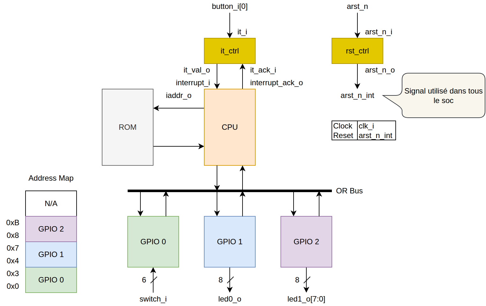

1. Placez-vous dans le dossier **labo06**

   ```bash
   cd labo06
   ```

2. Exécutez le script **init.sh**.

   ```bash
   ./init.sh
   ```

   Ce script va copier le dossier **labo05/asylum-soc-picosoc** dans le dossier **labo06**.

> [!CAUTION]
> Ce script ne doit être exécuté qu'une fois.

3. Le fichier **asylum-soc-picosoc/hdl/PicoSoC_supervisor.vhd** contient le SoC superviseur.

   Le SoC superviseur possède 2 contrôleurs GPIO et un controlleur d'interruption :
   - Le premier contrôlleur GPIO contient une sortie d’un bit et va être utilisée comme signal de reset du SoC applicatif
   - Le second contrôleur GPIO contient une sortie de 3 bits connectée aux leds LD17 à LD19.
   - Le GIC va prendre en entrée les erreurs soulevées par le SoC User et les concentrer vers le processeur du SoC superviseur.

   Modifiez le fichier **asylum-soc-picosoc/hdl/PicoSoC_top.vhd** pour instancier le SoC superviseur et le connecter avec le SoC applicatif.

4. Simuler avec la règle **sim_soc3_c_modbus_rtu**

   Le comportement doit être inchangé.

5. Modifier votre design pour injecter une erreur sur une entrée du processeur. L'erreur injectée sera sur les bits de poids fort de l'instruction provenant de la ROM (entrée *idata_i*) du processeur. Cela va corrompre l'instruction entrante.

    Utilisez le paramètre générique **FAULT_INJECTION**.

    | HDL Name          | Location   | PCB  | Comment                                                                       |
    |-------------------|------------|------|-------------------------------------------------------------------------------|
    | inject_error_i[0] | IOB10_D07P | S8   | Injection d'une erreur sur le processeur 0 - Corruption du bit 17             |
    | inject_error_i[1] | IOB10_D12P | S9   | Injection d'une erreur sur le processeur 1 - Corruption du bit 16             |
    | inject_error_i[2] | IOB10_D07N | S10  | Injection d'une erreur sur le processeur 2 - Corruption du bit 15 (cf labo07) |

6. Simuler avec la règle **sim_soc3_fault_c_modbus_rtu**.

   Ce test va injecter des erreurs dans le processeur et vérifier que l'application subit bien un reset.

7. Valider sur carte avec la règle **emu_soc3_fault_c_modbus_rtu**.

## labo07 : TMR

Dans ce labo, nous allons modifier les processeurs en lock-step du SoC applicatif par des processeurs avec triplication.


1. Placez-vous dans le dossier **labo07**

   ```bash
   cd labo07
   ```

2. Exécuter le script **init.sh**.

   ```bash
   ./init.sh
   ```

   Ce script va copier le dossier **labo06/asylum-soc-picosoc** dans le dossier **labo07**.

> [!CAUTION]
> Ce script ne doit être exécuté qu'une fois.

3. Éditez le fichier **asylum-soc-picosoc/hdl/PicoSoC_user.vhd** pour ajouter les modifications suivantes :

   1. Un troisième processeur dans le SoC applicatif
   2. Toutes les sorties des 3 processeurs doivent être votées (vers la ROM, vers l'ICN et l'acquittement des interruptions)
   3. Les différences doivent être calculées processeur par processeur et être envoyées au SoC superviseur (le registre *diff_r* est donc sur 3 bits)

4. Éditez le gestionnaire d’interruption défini dans le fichier asylum-soc-picosoc/esw/supervisor.c.

   Ce dernier va lire l’état des interruptions et en déduire quel est le processeur fautif. Si c’est la première erreur détectée, alors il va masquer les interruptions provenant de ce processeur.

   Si une seconde erreur est détectée alors le SoC applicatif va être remis à zéro.

   - Pourquoi ne faisons-nous pas de reset après la première erreur détectée ?
   - Pourquoi ne faisons-nous pas de reset du processeur fautif uniquement ?
   - Pourquoi pouvons-nous continuer l'exécution avec un processeur ayant une erreur ?

5. Simuler avec la règle **sim_soc4_fault_c_modbus_rtu**.

   Ce test va injecter des erreurs dans le processeur et vérifier que l'application subit bien un reset.

6. Valider sur carte avec la règle **emu_soc4_fault_c_modbus_rtu**.

## Annexe : Contournement d’une erreur dans le compilateur C

La fonction suivante ne compile pas correctement :

```c
void isr (void) __interrupt(1)
{
PORT_WR(LED1,cpt);
cpt ++;
}
```

En assembleur cela donne :

```assembler
_isr:
; soft/identity.c:34: PORT_WR(LED1,cpt);
STORE s0, (sF)   ; Sauvegarde du contexte d'exécution
SUB sF, 01       ; Décrément du pointeur de pile
FETCH s0, _cpt
OUTPUT s0, 08
; soft/identity.c:35: cpt ++;
ADD s0, 01
ADD sF, 01       ; Incrément du pointeur de pile
FETCH s0, (sF)   ; Restauration du contexte d'exécution (sF est le pointeur de pile)
STORE s0, _cpt   ; Mise à jour de cpt, s0 ne contient plus cpt !!!
RETURNI ENABLE
```

L’instruction STORE est placée après la restauration du contexte.

Le contournement trouvé est d’appeler une fonction **null** avant de chaque retour de fonction pour obliger le compilateur à mettre à jour les variables globales.

```c
void null (void)
{
// Empty
}

void isr (void) __interrupt(1)
{
PORT_WR(LED1,cpt);
cpt ++;

null();
}
```

```assembler
; soft/identity.c:27: void null (void)
_null:
; soft/identity.c:30: }
RETURN
; soft/identity.c:32: void isr (void) __interrupt(1)
_isr:
; soft/identity.c:34: PORT_WR(LED1,cpt);
STORE s0, (sF)   ; Sauvegarde du contexte d'exécution
SUB sF, 01       ; Décrément du pointeur de pile
FETCH s0, _cpt
OUTPUT s0, 08
; soft/identity.c:35: cpt ++;
ADD s0, 01
; soft/identity.c:40: null();
STORE s0, _cpt   ; Mise à jour de cpt
CALL _null
ADD sF, 01       ; Incrément du pointeur de pile
FETCH s0, (sF)   ; Restauration du contexte d'exécution (sF est le pointeur de pile)
RETURNI ENABLE
```

