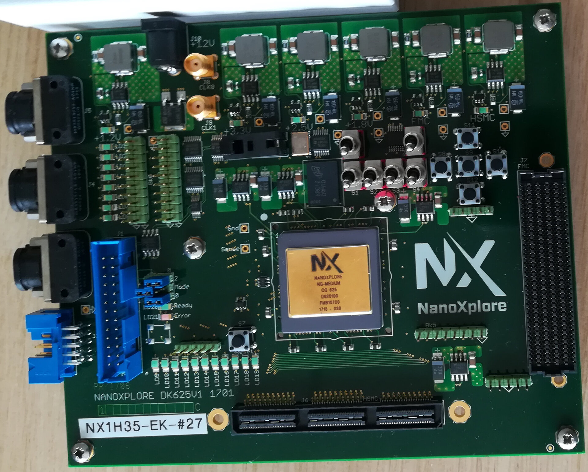
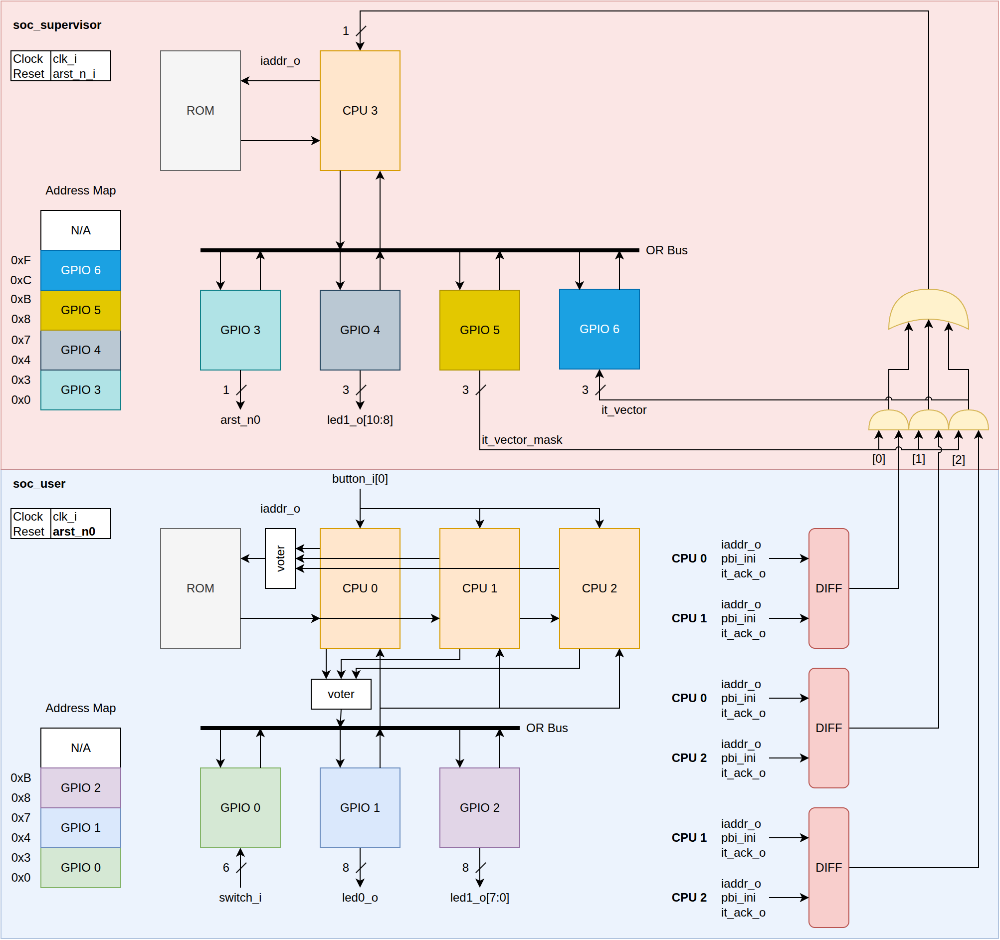

# ESIEE_SEI_5201A

## Table des matières

- [Préambule](#préambule)
  - [Évaluation](#évaluation)
  - [Environnement logiciel](#environnement-logiciel)
  - [Environnement matériel](#environnement-matériel)
  - [Documentation](#documentation)
  - [Sources](#sources)
- [labo01 : Prise en main de l'outil Impulse](#labo01--prise-en-main-de-loutil-impulse)
- [labo02 : Safety Package](#labo02--safety-package)
- [labo03 : Étude du SoC (USER + Superviseur) et gestion des erreurs](#labo03--étude-du-soc-user--superviseur-et-gestion-des-erreurs)
- [labo04 : CPU – Registres TMR](#labo04--cpu--registres-tmr)
- [labo05 : CPU – Banc de registres ECC et Scrubbing](#labo05--banc-de-registres-ecc-et-scrubbing)
- [labo06 : SoC USER – Lock-Step](#labo06--soc-user--lock-step)
- [labo07 : SoC USER – TMR](#labo07--soc-user--tmr)
- [Annexe : Contournement d’une erreur dans le compilateur C](#annexe--contournement-dune-erreur-dans-le-compilateur-c)

---

## Préambule

Dans ces séances de TP, nous allons utiliser un System-on-Chip (SoC) académique à base d'un processeur RISC-V et de plusieurs périphériques (GPIO, UART, SPI, Timer, ...), et nous allons rendre le système tolérant aux fautes pour des applications spatiales contraintes.

Les TPs sont découpés en 4 grandes étapes :

1. **Prise en main** de l'environnement logiciel et matériel (*labo01*).
2. **Implémentation des techniques de sûreté** dans une bibliothèque dédiée (*labo02* : Safety Package).
3. **Modification directe des sources du CPU** pour intégrer les mécanismes de sûreté au cœur du processeur (*labo03*, *labo04* et *labo05*).
4. **Modification directe des sources du SoC** (`cpu_safety`) pour sécuriser le système par duplication (*labo06* : Lock-Step) puis triplication (*labo07* : TMR).

> [!IMPORTANT]
> Les premiers labos sont dirigistes ; la difficulté et l'autonomie requise sont croissantes.

---

### Évaluation

#### Livraison

Une archive contenant votre rapport au format PDF ainsi que l'ensemble de vos codes sources modifiés.

#### Rapport

Un rapport d’une dizaine de pages doit être fourni pour évaluer les acquis de cette unité.

> [!IMPORTANT]
> Vous pouvez utiliser l'IA pour générer votre rapport, cependant il faudra le préciser explicitement dans l'introduction.

Ce rapport possède les sections suivantes :

- **Introduction**
  - Explication des enjeux d’un circuit numérique pour une application spatiale (effets des radiations, SEE, SEU, SEL).
- **Outils et environnement** (labo 01)
  - Prise en main des outils (Impulse, flux NanoXplore), complexité et problèmes rencontrés.
- **Safety Package** (labo 02)
  - Présentation de la bibliothèque de protection de données.
  - Avantages et inconvénients de la parité paire par rapport à la parité impaire.
  - Tableau comparatif des 4 approches (None, Parité, TMR, ECC 32b) : nombre d'erreurs détectées et corrigées « à coup sûr ».
  - Synthèse et comparaison des ressources sous Impulse.
- **Étude du SoC & Superviseur** (labo 03)
  - Inventaire des éléments mémorisants du CPU et des signaux d'erreurs.
  - Explication du rôle du superviseur et des actions entreprises.
  - Réponses obligatoires aux 4 questions d'analyse d'impact d'un SEE :
    1. Que se passe-t-il si un SEE intervient dans l'un des processeurs applicatifs ?
    2. Que se passe-t-il si un SEE intervient dans l'un des GPIOs du SoC applicatif ?
    3. Que se passe-t-il si un SEE intervient dans le processeur du SoC superviseur ?
    4. Que se passe-t-il si un SEE intervient dans l'un des GPIOs du SoC superviseur ?
  - Résultats de référence (ressources LUT/DFF et $F_{\max}$).
- **CPU durci : Registres TMR & ECC/Scrubbing** (labo 04 & labo 05)
  - Modifications apportées aux sources HDL du CPU.
  - Réponse à la question : nombre de cycles minimum et maximum avant la correction d'une erreur par le *scrubber*.
  - Résultats de synthèse (ressources LUT/DFF, impact sur $F_{\max}$).
- **SoC USER Lock-Step** (labo 06)
  - Modifications apportées au module `cpu_safety`.
  - Réponses aux questions sur `LOCK_STEP_DEPTH` (rôle, valeur optimale entre 0, 2 et 10).
  - Résultats de synthèse et performances.
- **SoC USER TMR** (labo 07)
  - Implémentation du TMR au niveau système.
  - Résultats de synthèse et performances.
- **Conclusion**
  - Comparaison globale entre une approche non tolérante aux radiations et les différentes architectures résistantes (facilité de mise en œuvre, surcoût en surface, impact sur la fréquence d’horloge).

---

### Environnement logiciel

Pour réaliser ce TP, l'environnement logiciel est encapsulé dans une machine virtuelle basée sur une distribution CentOS 8 dont les identifiants sont :

> [!IMPORTANT]
> **Login**    : user  
> **Password** : user

---

### Environnement matériel

Ce TP utilise la carte de développement DK625 intégrant un FPGA rad-hard NX1H35S de la société NanoXplore (35K LUTs).

Deux outils principaux sont utilisés :
- **impulse** : génère le bitstream à partir des codes VHDL / Verilog.
- **nxbase** / **nxbase2** : télécharge le bitstream dans le FPGA.



---

### Documentation

| Documentation | Lien |
|---------------|------|
| CPU | [ug129](https://docs.amd.com/v/u/en-US/ug129) |
| Devkit | [NanoXplore_NX1H35S_DevKitV3_User_Guide](https://files.nanoxplore.com/f/79d605999def475da0ec/) |
| Schematics | [NanoXplore_NX1H35S_DevKitV3_Schematics](https://files.nanoxplore.com/f/c5dcf72c018e44939a2f) |
| NG-MEDIUM | [NanoXplore NX1H35AS Datasheet](https://files.nanoxplore.com/f/5ad5e8a333654fb2ac76) |

---

### Sources

Les sources de la formation sont hébergées sur le dépôt Git principal.
Pour récupérer l'environnement de travail :

```bash
git clone https://github.com/deuskane/ESIEE_SEI_5201A.git
```

---

## labo01 : Prise en main de l'outil Impulse

Dans cette première partie, nous allons prendre en main l’environnement logiciel **impulse**.

1. Éditez le fichier *labo01/hdl/labo01.vhd* pour réaliser la fonctionnalité illustrée ci-dessous :
   

2. Dans le répertoire *labo01/project*, lancez la commande **impulse**.
   

3. Créez un nouveau projet (Create New Project ou File/Project) :
   - **Onglet « 1. Set Project Information »**
     - Project Name : `labo01`
     - Path : `labo01/project`
   - **Onglet « 2. Add Sources »**
     - Ajouter `labo01/hdl/labo01.vhd`
     - Top cell name : `labo01`
   - **Onglet « 4. Select Devices »**
     - Device : `NG-MEDIUM`
     - Package : `LGA-625`
   - **Onglet « 5. Project Summary »** : Vérifiez puis cliquez sur **Finish**.

4. Sauvegardez votre projet (`File > Save Project`).

5. **Synthèse** : Cliquer sur *Synthesis*. Complétez le fichier `labo01.vhd` jusqu'à ce que la synthèse s'exécute sans erreur.

6. **Affectation des E/S** : Configurez la cartographie selon le tableau ci-dessous :

   | HDL Name | FPGA Name | PCB Name |
   |---|---|---|
   | led_n_o[0] | IOB0_D01P | LD1 |
   | led_n_o[1] | IOB0_D03N | LD2 |
   | led_n_o[2] | IOB0_D03P | LD3 |
   | led_n_o[3] | IOB1_D05N | LD4 |
   | led_n_o[4] | IOB1_D05P | LD5 |
   | led_n_o[5] | IOB1_D06N | LD6 |
   | led_n_o[6] | IOB1_D06P | LD7 |
   | led_n_o[7] | IOB1_D02N | LD8 |
   | switch_i[0] | IOB10_D09P | S1 |
   | switch_i[1] | IOB10_D03P | S2 |
   | switch_i[2] | IOB10_D03N | S3 |
   | switch_i[3] | IOB10_D04P | S4 |
   | switch_i[4] | IOB10_D09N | S5 |
   | switch_i[5] | IOB10_D04N | S6 |

   | Bank Name | Voltage |
   |---|---|
   | IOB0 | 3.3V |
   | IOB1 | 3.3V |
   | IOB10 | 1.8V |

   Exportez la configuration dans `labo01/hdl/pads.py`.

7. Sauvegardez le projet.
8. Exécutez : **Place**, **Route**, puis **Bitstream**.
9. Téléchargez le bitstream sur la carte (depuis `labo01/nxmap`) :

   ```bash
   nxbase2 labo01.nxb
   ```

---

## labo02 : Safety Package

Dans ce laboratoire, vous allez concevoir et valider une bibliothèque VHDL de sûreté de fonctionnement pour protéger des mots de données contre les erreurs de bits (SEU).

1. Placez-vous dans le dossier `labo02/safety_pkg`.

   Le dossier contient un fichier **safety_pkg.core**. Il est utilisé par l'outil **fusesoc** ([https://github.com/olofk/fusesoc](https://github.com/olofk/fusesoc)). Ce logiciel gère les IPs et aide à créer, construire et simuler des SoC.

   Les appels à **fusesoc** sont encapsulés dans un **Makefile**.

   Vous pouvez afficher l'aide avec la règle *help* :

   ```bash
   make help
   ```

1. Le dossier contient également 2 répertoires :
   - **hdl** : sources de l'IP
   - **sim** : tests unitaires de l'IP

   Dans ce labo, vous devez compléter le corps du package (`hdl/safety_pkg_body.vhd`)

   Ce package définit 5 schémas de protection :
   - **None**: aucune protection
   - **Parité Paire**: ajout d'un bit de parité paire
   - **Parité Impaire**: ajout d'un bit de parité impaire
   - **TMR**: Triple Modular Redundancy avec vote majoritaire
   - **ECC**: SEC-DED / code de Hamming.

   L'API contient 4 fonctions:
   - `encoded_size`: retourne la taille du vecteur en incluant les bits de redondance.
   - `decoded_size`: retourne la taille du vecteur en excluant les bits de redondance.
   - `encode`: retourne la donnée avec les bits de redondances
   - `decode`: retourne la donnée (corrigée si possible) avec les drapeaux suivants :
     - `error_detected` : est à 1 si une erreur (corrigée ou non) a été détectée
     - `error_corrected` : est à 1 si la fonction decode à corrigé une erreur.

   Pour lancer simulation, il faut utiliser la règle correspondante :
   ```bash
   make sim_safety_none
   ```

   Pour lancer la synthèse sur FPGA, il faut utiliser la règle correspondante :
   ```bash
   make emu_ng_medium_safety_dff_none
   ```

   - Le rapport d'utilisation du FPGA est disponible ici :

     `build/asylum_utils_safety_1.0.0/emu_ng_medium_safety_dff_none-nxmap/work/routing/instances.rpt`

   - Le rapport de timing est disponible ici :

     `build/asylum_utils_safety_1.0.0/emu_ng_medium_safety_dff_none-nxmap/work/routing/general.log`

   Pour lancer une **STA** complète :

   ```bash
   cd  build/asylum_utils_safety_1.0.0/emu_ng_medium_safety_dff_none-nxmap

   make sta
   ```

   Les rapports de timings sont disponibles ici :
   
   - `build/asylum_utils_safety_1.0.0/emu_ng_medium_safety_dff_none-nxmap/work/logsPython/Summary_Routed3_worstcase.timing`
   - `build/asylum_utils_safety_1.0.0/emu_ng_medium_safety_dff_none-nxmap/work/logsPython/Summary_Routed3_typical.timing`
   - `build/asylum_utils_safety_1.0.0/emu_ng_medium_safety_dff_none-nxmap/work/logsPython/Summary_Routed3_bestcase.timing`

   Des rapports plus complets sont disponibles dans le même dossier

1. Implémenter la variante **Parité paire**


4. **Questions à traiter** :
   - **Parité** : Quels sont les avantages et les inconvénients de la parité paire par rapport à la parité impaire ?
   - **Comparaison** : Réaliser un tableau comparatif des 4 approches précisant le nombre d'erreurs détectées et corrigées « à coup sûr ».

5. **Simulation et Synthèse** :
   - Écrire des bancs de tests avec injection d'erreurs.
   - Effectuer la synthèse sous **Impulse** et comparer la consommation de ressources FPGA (LUTs, DFFs) pour chaque mode.

---

## labo03 : Étude du SoC (USER + Superviseur) et gestion des erreurs

À partir de ce laboratoire, nous ne modifions plus le Safety Package : les modifications s'effectuent **directement dans les sources du processeur et du SoC**.


1. Placez-vous dans le dossier `labo03` et exécutez le script d'importation :

   ```bash
   cd labo03
   ./import.sh
   ```

2. **Analyse du CPU** :
   - Établir le listing complet des éléments mémorisants du CPU (registres, pointeurs, bascules d'état de la FSM).
   - Relever l'ensemble des signaux d'erreurs générés par le CPU.

3. **Étude du Superviseur** :
   - Analyser l'architecture du SoC superviseur et les actions de sûreté qu'il déclenche en cas de défaillance.

4. **Questions d'analyse d'impact (SEE)** :
   - Que se passe-t-il si un SEE intervient dans l'un des processeurs applicatifs ?
   - Que se passe-t-il si un SEE intervient dans l'un des GPIOs du SoC applicatif ?
   - Que se passe-t-il si un SEE intervient dans le processeur du SoC superviseur ?
   - Que se passe-t-il si un SEE intervient dans l'un des GPIOs du SoC superviseur ?

5. **Simulation, Synthèse et Validation** :
   - Lancer la simulation avec l'application de référence.
   - Effectuer la synthèse sous Impulse pour extraire les métriques de référence (ressources LUT/DFF et $F_{\max}$).
   - Valider le fonctionnement sur la carte DK625.

---

## labo04 : CPU – Registres TMR

Dans ce laboratoire, vous allez modifier **directement le code VHDL du CPU** pour sécuriser l'ensemble de ses registres internes.

1. Placez-vous dans le dossier `labo04` et importez les sources :

   ```bash
   cd labo04
   ./import.sh
   ```

2. **Modification du CPU** :
   - Modifier le CPU pour remplacer les registres standards par des registres TMR (triplés avec voteurs majoritaires).
   - Interconnecter les signaux d'erreurs/désaccords du CPU.

3. **Simulation** :
   - Injecter des erreurs dans les registres pendant l'exécution pour vérifier la tolérance aux fautes.

4. **Synthèse et Évaluation** :
   - Synthétiser la conception sous Impulse.
   - Évaluer le surcoût en surface (LUTs, DFFs) et l'impact sur la fréquence maximale d'horloge ($F_{\max}$).

5. **Validation** :
   - Valider l'exécution sur la carte.

---

## labo05 : CPU – Banc de registres ECC et Scrubbing

Dans ce laboratoire, vous allez modifier **directement le banc de registres du CPU** pour y intégrer un mécanisme de correction ECC et un balayage actif (*scrubbing*).

1. Placez-vous dans le dossier `labo05` et importez les sources :

   ```bash
   cd labo05
   ./import.sh
   ```

2. **Modification du CPU** :
   - Modifier le CPU pour ajouter un *scrubber* sur le banc de registres.
   - Interconnecter les signaux d'erreurs du banc de registres.

3. **Question** :
   - Lorsqu'une erreur intervient dans une case du banc de registres, quel est le nombre de cycles d'horloge **minimum** et **maximum** avant sa correction effective par le *scrubber* ?

4. **Simulation, Synthèse et Validation** :
   - Valider le fonctionnement et la correction en simulation.
   - Effectuer la synthèse sous Impulse pour évaluer le coût en performances et ressources.
   - Valider sur cible matérielle.

---

## labo06 : SoC USER – Lock-Step

Dans ce laboratoire, la protection est portée au niveau système en modifiant **directement le module `cpu_safety`** du SoC.

1. Placez-vous dans le dossier `labo06` et importez les sources :

   ```bash
   cd labo06
   ./import.sh
   ```

2. **Modification de `cpu_safety`** :
   - Modifier `cpu_safety` pour intégrer le fonctionnement en mode Lock-Step (duplication et comparaison pas-à-pas des sorties).

   

3. **Questions à traiter** :
   - À quoi sert le paramètre générique `LOCK_STEP_DEPTH` ?
   - Quelle valeur faut-il attribuer à `LOCK_STEP_DEPTH` entre **0**, **2** et **10** ? Justifier votre choix.

4. **Simulation, Synthèse et Validation** :
   - Valider la détection des erreurs en simulation.
   - Synthétiser sous Impulse pour évaluer l'impact en ressources et en fréquence.
   - Valider sur la carte.

---

## labo07 : SoC USER – TMR

Dans ce dernier laboratoire, vous allez appliquer la Redondance Triplée (TMR) à l'échelle du SoC applicatif en modifiant **directement le module `cpu_safety`**.

1. Placez-vous dans le dossier `labo07` et importez les sources :

   ```bash
   cd labo07
   ./import.sh
   ```

2. **Modification de `cpu_safety`** :
   - Modifier `cpu_safety` pour ajouter le TMR au niveau applicatif.

   

3. **Simulation** :
   - Vérifier en simulation que le système continue de fonctionner malgré l'injection de fautes sur l'un des processeurs.

4. **Synthèse et Évaluation** :
   - Effectuer la synthèse sous Impulse pour mesurer l'occupation globale du FPGA.
   - Comparer le coût en performances / ressources par rapport aux approches des labos précédents.

5. **Validation** :
   - Valider le fonctionnement sur le FPGA NanoXplore.

---

## Annexe : Contournement d’une erreur dans le compilateur C

Si vous rencontrez un comportement inattendu lors de la compilation des applications C pour le processeur RISC-V :

1. Déclarez systématiquement les pointeurs vers les registres matériels avec le qualificatif `volatile` :
   ```c
   #define REG_POINTER ((volatile uint32_t *) 0x70000000)
   ```
2. Si le compilateur génère une instruction non supportée par l'architecture, forcez l'utilisation de l'ISA de base sans extensions compressées via l'option du Makefile :
   ```makefile
   CFLAGS += -mabi=ilp32 -march=rv32i
   ```
